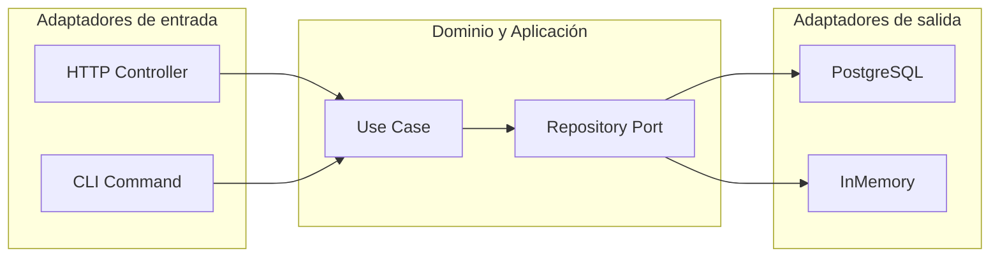

import DocsPageLayout from "/src/layouts/DocsPageLayout.astro";
import FileTree from "/src/components/global/FileTree.astro";

<DocsPageLayout
  title="Arquitectura Hexagonal | MyDevNotes"
  section="Arquitectura"
  pageTitle="Arquitectura Hexagonal"
  pageDescription="Ports & Adapters. El dominio al centro, la infraestructura afuera. Un patrón para aislar la lógica de negocio de los frameworks, bases de datos y servicios externos."
  prevPage={{ href: "/arquitectura/arquitectura-modular", label: "Arquitectura Modular" }}
  nextPage={{ href: "/arquitectura/arquitectura-limpia", label: "Arquitectura Limpia" }}
>
---
Aunque se popularizó como "Arquitectura Hexagonal" por la forma en que su creador, Alistair Cockburn, representó los múltiples puntos de entrada y salida del sistema, el nombre más preciso es **Arquitectura de Puertos y Adaptadores**. El hexágono no tiene nada de especial en sí mismo: es solo una forma de dibujar que tiene suficientes lados para representar las distintas conexiones al exterior.

La idea central es simple: el dominio de negocio vive en el centro y no depende de nada que esté afuera. Todo lo que necesita para comunicarse con el exterior lo hace a través de interfaces que él mismo define.

### El problema que resuelve

En arquitecturas por capas mal gestionadas, la lógica de negocio termina mezclada con detalles de infraestructura. Empieza con algo aparentemente inofensivo: decoradores de un ORM directamente en las entidades de negocio, o llamadas directas a una librería de terceros desde un servicio de aplicación.

El resultado es un núcleo de negocio acoplado al framework. Migrar a una nueva tecnología se vuelve costoso. Actualizar versiones es arriesgado. Y testear la lógica de negocio exige levantar bases de datos, servidores HTTP o conexiones a servicios externos.

La arquitectura hexagonal resuelve esto con una regla estricta: **las dependencias siempre apuntan hacia adentro**. El dominio no conoce a nadie. Todos conocen al dominio.

### Puertos y adaptadores

El dominio se comunica con el exterior a través de dos piezas.

Un **puerto** es una interfaz que define qué necesita o qué ofrece el dominio. Vive dentro del dominio o la capa de aplicación. Declara el contrato sin conocer la implementación.

Un **adaptador** es la implementación concreta de ese contrato. Vive en la capa de infraestructura y sabe cómo traducir el requerimiento del puerto hacia la tecnología real.



Los adaptadores de entrada inician la acción desde afuera hacia adentro. Los adaptadores de salida son llamados por el dominio cuando necesita persistir datos o contactar servicios externos.

### 1. El dominio

El dominio contiene las entidades y los puertos de salida. No importa ningún framework, ningún ORM, ninguna librería externa.

```ts
// domain/User.ts — entidad pura, sin dependencias externas
export class User {
  constructor(
    public readonly id: string,
    public readonly email: string,
    public readonly name: string,
  ) {}

  isValidEmail(): boolean {
    return this.email.includes("@");
  }
}
```

```ts
// domain/UserRepositoryPort.ts — puerto de salida
// El dominio define qué necesita, no cómo se implementa
export interface UserRepositoryPort {
  findByEmail(email: string): Promise<User | null>;
  save(user: User): Promise<void>;
}
```

La entidad `User` no tiene decoradores de base de datos ni hereda de ninguna clase del framework. El puerto `UserRepositoryPort` no sabe si por debajo hay Postgres, MongoDB o un array en memoria.

### 2. La capa de aplicación

Los casos de uso orquestan la lógica de negocio. Dependen de puertos (interfaces), nunca de implementaciones concretas.

```ts
// application/CreateUserUseCase.ts
export class CreateUserUseCase {
  constructor(private userRepo: UserRepositoryPort) {}

  async execute(input: CreateUserInput): Promise<User> {
    const existing = await this.userRepo.findByEmail(input.email);
    if (existing) throw new ConflictError("El email ya está registrado");

    const user = new User(generateId(), input.email, input.name);
    await this.userRepo.save(user);
    return user;
  }
}
```

`CreateUserUseCase` no sabe que existe Postgres. Solo sabe que necesita algo que implemente `UserRepositoryPort`. Eso es inyección de dependencias aplicada a nivel arquitectónico.

### 3. Los adaptadores

Los adaptadores de entrada reciben la señal del exterior y la traducen hacia el caso de uso.

```ts
// infrastructure/input/UserRestController.ts
export class UserRestController {
  constructor(private createUser: CreateUserUseCase) {}

  async handlePost(req: Request): Promise<Response> {
    const user = await this.createUser.execute(req.body);
    return Response.json(user, { status: 201 });
  }
}
```

El controlador no tiene lógica de negocio. Recibe la request, llama al caso de uso y serializa la respuesta.

Los adaptadores de salida implementan los puertos con la tecnología concreta.

```ts
// infrastructure/output/PostgresUserRepository.ts
export class PostgresUserRepository implements UserRepositoryPort {
  async findByEmail(email: string): Promise<User | null> {
    const row = await this.db.users.findOne({ where: { email } });
    return row ? new User(row.id, row.email, row.name) : null;
  }

  async save(user: User): Promise<void> {
    await this.db.users.create({
      id: user.id,
      email: user.email,
      name: user.name,
    });
  }
}
```

`PostgresUserRepository` implementa `UserRepositoryPort`. El dominio nunca lo conoce directamente. Solo conoce la interfaz.

### Estructura de carpetas

<FileTree
  tree={`
src/users/
  domain/
    User.ts # Entidad pura
    UserRepositoryPort.ts # Puerto de salida
  application/
    CreateUserUseCase.ts # Puerto de entrada (caso de uso)
  infrastructure/
    input/
      UserRestController.ts # Adaptador primario (HTTP)
    output/
      PostgresUserRepository.ts # Adaptador secundario (DB)
`}
/>

La regla de dependencia es visible en la estructura: `infrastructure` puede importar de `application` y `domain`, pero nunca al revés.

### Testing sin infraestructura

El mayor beneficio práctico de este patrón es en los tests. Como el dominio depende solo de interfaces, basta con crear un adaptador en memoria que las implemente.

```ts
// infrastructure/output/InMemoryUserRepository.ts
export class InMemoryUserRepository implements UserRepositoryPort {
  private users: User[] = [];

  async findByEmail(email: string): Promise<User | null> {
    return this.users.find((u) => u.email === email) ?? null;
  }

  async save(user: User): Promise<void> {
    this.users.push(user);
  }
}
```

```ts
// Tests rápidos, sin base de datos ni mocks de framework
it("debería rechazar emails duplicados", async () => {
  const repo = new InMemoryUserRepository();
  const useCase = new CreateUserUseCase(repo);

  await useCase.execute({ email: "ana@mail.com", name: "Ana" });

  await expect(
    useCase.execute({ email: "ana@mail.com", name: "Ana" })
  ).rejects.toThrow(ConflictError);
});
```

El test prueba la lógica de negocio en milisegundos. No hay Docker, no hay base de datos, no hay servidor HTTP. Si el test duele, el diseño tiene un problema, no el test.

### Cuándo usarla y cuándo no

Tiene sentido cuando:

* El dominio tiene lógica de negocio compleja con muchas reglas.
* El sistema necesita integrarse con múltiples tecnologías de infraestructura (bases de datos, colas, APIs externas).
* Testear la lógica de negocio en aislamiento es una prioridad.

Es probablemente sobreingeniería cuando:

* La aplicación es mayormente CRUD sin lógica compleja.
* El equipo es pequeño y el proyecto está en etapa temprana.
* La ganancia en testabilidad no justifica la estructura adicional.

### Cómo se conecta

* **Arquitectura por capas:** la hexagonal no reemplaza las capas, las redistribuye. Controller, Use Case y Repository siguen existiendo, pero las dependencias se invierten para que el dominio no dependa de la infraestructura.
* **Arquitectura modular:** ambas se complementan. La modular define los límites entre módulos; la hexagonal define cómo organizar el interior de cada módulo cuando la lógica es compleja.
* **SOLID:** la arquitectura hexagonal es la aplicación a nivel de sistema de la inversión de dependencias (`D`). El puerto es la abstracción; el adaptador es el detalle.
* **Testing como señal de diseño:** si testear un caso de uso requiere levantar infraestructura real, la separación entre dominio e infraestructura no está completa.

### Regla práctica
Si cambiar de base de datos o de framework obliga a tocar la lógica de negocio, la separación entre dominio e infraestructura no existe todavía.
</DocsPageLayout>
