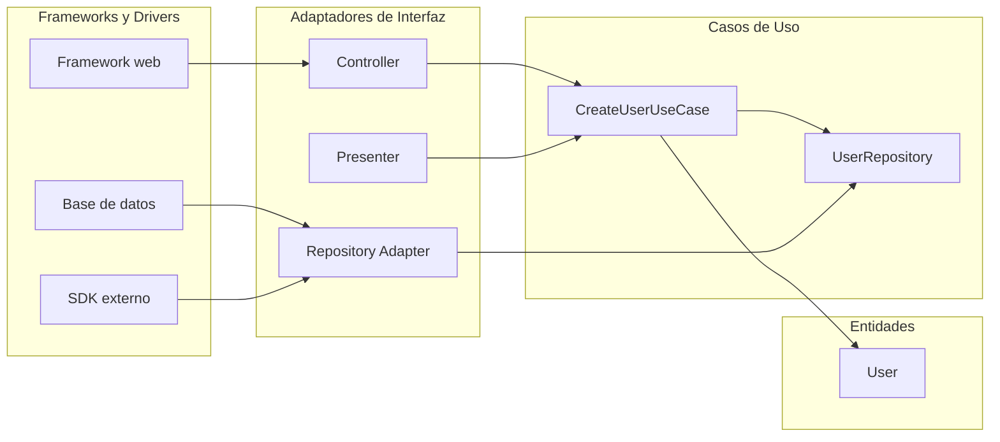

import DocsPageLayout from "/src/layouts/DocsPageLayout.astro";
import FileTree from "/src/components/global/FileTree.astro";

<DocsPageLayout
  title="Arquitectura Limpia | MyDevNotes"
  section="Arquitectura"
  pageTitle="Arquitectura Limpia"
  pageDescription="Entidades, casos de uso, adaptadores y frameworks. Una forma de organizar el sistema para que la lógica de negocio no dependa de HTTP, bases de datos ni librerías externas."
  prevPage={{ href: "/arquitectura/arquitectura-hexagonal", label: "Arquitectura Hexagonal" }}
  nextPage={{ href: "/arquitectura/monolito-modular-vs-microservicios", label: "Monolito Modular vs. Microservicios" }}
>
---
La arquitectura limpia intenta resolver un problema muy concreto: que las decisiones más volátiles del sistema, como el framework, la base de datos o un SDK externo, no contaminen la lógica que realmente hace valioso al producto.

La idea no es "poner más capas porque sí". La idea es que el negocio siga siendo estable aunque cambien los detalles de entrega y persistencia. Si mañana se reemplaza Express por Fastify, PostgreSQL por DynamoDB o un proveedor de pagos por otro, la lógica central no debería enterarse.

### El problema que resuelve

En muchos backends, la lógica de negocio termina pegada a la infraestructura sin que nadie lo decida explícitamente. Un servicio depende directamente del ORM. Una entidad tiene decoradores del framework. Un caso de uso conoce detalles de HTTP. Todo funciona al principio, pero el costo aparece después.

Cada cambio técnico obliga a tocar código que en teoría representa reglas de negocio. El resultado es un sistema difícil de testear, costoso de migrar y frágil frente a cambios que deberían ser locales.

La arquitectura limpia responde con una regla estricta: **las dependencias del código solo pueden apuntar hacia adentro**.



El flujo de control puede ir desde afuera hacia adentro, pero las dependencias de código siguen la dirección opuesta. El `controller` conoce el caso de uso. El caso de uso no sabe que existe HTTP.

### Los cuatro anillos

### 1. Entidades

Son el centro del sistema. Encapsulan las reglas más estables del negocio y deberían sobrevivir a casi cualquier cambio técnico.

```ts
export class User {
  constructor(
    public readonly id: string,
    public readonly email: string,
    public readonly createdAt: Date,
  ) {}

  hasValidEmail(): boolean {
    return this.email.includes("@");
  }
}
```

`User` no importa nada del framework, del ORM ni de la base de datos. Si necesita reglas, las contiene. Si no las contiene, es una señal de que la lógica se está escapando hacia afuera.

### 2. Casos de uso

Aquí vive la lógica específica de la aplicación. Los casos de uso orquestan entidades y definen qué necesita el sistema del exterior a través de interfaces.

```ts
export interface UserRepository {
  findByEmail(email: string): Promise<User | null>;
  save(user: User): Promise<void>;
}

export interface CreateUserInput {
  email: string;
}

export class CreateUserUseCase {
  constructor(private readonly userRepository: UserRepository) {}

  async execute(input: CreateUserInput): Promise<User> {
    const existing = await this.userRepository.findByEmail(input.email);
    if (existing) throw new Error("Email already in use");

    const user = new User(crypto.randomUUID(), input.email, new Date());
    if (!user.hasValidEmail()) throw new Error("Invalid email format");

    await this.userRepository.save(user);
    return user;
  }
}
```

Lo importante no es la interfaz en sí. Lo importante es quién la define. En arquitectura limpia, la necesidad nace adentro y la implementación ocurre afuera.

### 3. Adaptadores de interfaz

Son traductores. Convierten datos externos al formato que entienden los casos de uso, y convierten la respuesta del caso de uso al formato que necesita el mundo exterior.

```ts
type CreateUserRequest = {
  body: { email: string };
};

type HttpResponse = {
  status(code: number): HttpResponse;
  json(payload: unknown): void;
};

export class UserController {
  constructor(private readonly createUser: CreateUserUseCase) {}

  async handle(request: CreateUserRequest, response: HttpResponse): Promise<void> {
    try {
      const user = await this.createUser.execute({ email: request.body.email });
      response.status(201).json({
        id: user.id,
        email: user.email,
        createdAt: user.createdAt.toISOString(),
      });
    } catch (error) {
      const message = error instanceof Error ? error.message : "Unexpected error";
      response.status(400).json({ error: message });
    }
  }
}
```

El controlador no valida reglas de negocio complejas, no conoce SQL y no decide cómo persistir. Traduce la request, delega y formatea la respuesta.

### 4. Frameworks y drivers

Es la periferia del sistema. Base de datos, framework HTTP, SDKs, colas, drivers, clientes externos. Todo lo que cambia más rápido debería quedar aquí.

```ts
export class PostgresUserRepository implements UserRepository {
  constructor(private readonly db: { user: {
    findUnique(args: unknown): Promise<{ id: string; email: string; createdAt: Date } | null>;
    create(args: unknown): Promise<void>;
  } }) {}

  async findByEmail(email: string): Promise<User | null> {
    const row = await this.db.user.findUnique({ where: { email } });
    return row ? new User(row.id, row.email, row.createdAt) : null;
  }

  async save(user: User): Promise<void> {
    await this.db.user.create({
      data: {
        id: user.id,
        email: user.email,
        createdAt: user.createdAt,
      },
    });
  }
}
```

Si mañana cambia Prisma por SQL directo, este adaptador cambia. El caso de uso no.

### Cómo se ve en un proyecto real

<FileTree
  tree={`
src/users/
  domain/
    User.ts
  application/
    CreateUserUseCase.ts
    UserRepository.ts
  interface-adapters/
    UserController.ts
    UserPresenter.ts
  infrastructure/
    PostgresUserRepository.ts
`}
/>

No hace falta que todos los proyectos usen exactamente estos nombres. Lo importante es que la dirección de dependencias siga siendo visible en la estructura.

### Arquitectura Limpia vs. Arquitectura Hexagonal

Ambas apuntan a lo mismo: separar el núcleo del negocio de la infraestructura y forzar inversión de dependencias. La diferencia real está en cuánto prescriben la forma interna.

| Aspecto | Arquitectura Hexagonal | Arquitectura Limpia |
| --- | --- | --- |
| Idea central | Puertos y adaptadores alrededor del dominio. | Anillos con niveles claros de responsabilidad. |
| Enfoque | Se enfoca en cómo entra y sale información del sistema. | Se enfoca además en cómo organizar el interior del sistema. |
| Casos de uso | Pueden estar implícitos dentro del núcleo. | Son una capa explícita y separada. |
| Vocabulario | `ports`, `adapters`, `driving`, `driven`. | `entities`, `use cases`, `interface adapters`, `frameworks`. |
| Rigidez estructural | Más flexible en la forma interna. | Más prescriptiva con las capas. |

En la práctica, muchas implementaciones mezclan ambas ideas. Es normal ver un módulo con capas al estilo arquitectura limpia y, al mismo tiempo, puertos y adaptadores al estilo hexagonal. No hay contradicción ahí.

### Cuándo aporta valor de verdad

Tiene sentido cuando:

* El negocio tiene reglas densas y no es solo un CRUD con validaciones menores.
* Se espera una vida útil larga con varios equipos tocando el sistema.
* Hay alta probabilidad de cambiar infraestructura o integrar múltiples sistemas externos.
* La testabilidad del núcleo es una prioridad real y no solo un deseo abstracto.

Empieza a ser impuesto cuando:

* La aplicación es mayormente CRUD y la complejidad vive en formularios o consultas simples.
* El proyecto es un MVP donde la velocidad inicial importa más que la flexibilidad futura.
* El servicio es pequeño, aislado y probablemente será reemplazado antes que evolucionado.
* El equipo termina escribiendo más mapeos, interfaces y DTOs que reglas reales de negocio.

El costo existe. Más archivos, más traducciones entre capas y más disciplina para no romper los límites. Si esa complejidad adicional no protege algo valioso, solo agrega fricción.

### Cómo se conecta

* **Arquitectura por capas:** la arquitectura limpia también usa capas, pero no solo separa presentación, negocio y datos. Además fuerza que las dependencias apunten hacia el núcleo.
* **Arquitectura modular:** un monolito modular puede organizar cada módulo internamente con arquitectura limpia si el dominio de ese módulo lo justifica.
* **Arquitectura hexagonal:** hexagonal y clean comparten la inversión de dependencias. La diferencia es que clean explicita mejor el rol de entidades y casos de uso.
* **SOLID:** es una aplicación a nivel de sistema del principio de inversión de dependencias (`D`) y, en menor medida, de responsabilidad única (`S`).
* **Testing como señal de diseño:** si para probar un caso de uso necesitas levantar HTTP o una base de datos, la arquitectura no está aislando el negocio de verdad.

### Regla práctica

Si un cambio en la base de datos, el framework o un SDK obliga a modificar reglas de negocio, el núcleo todavía no está protegido. Si protegerlo cuesta más de lo que el proyecto gana, la arquitectura limpia no era la herramienta correcta.
</DocsPageLayout>
