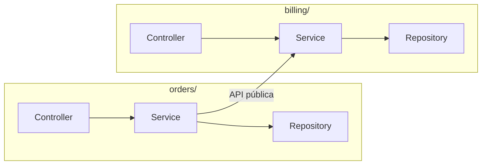

import DocsPageLayout from "/src/layouts/DocsPageLayout.astro";

<DocsPageLayout
  title="Arquitectura Modular | MyDevNotes"
  section="Arquitectura"
  pageTitle="Arquitectura Modular"
  pageDescription="Organizar el código por funcionalidad de negocio en lugar de por tipo técnico. La arquitectura modular resuelve los problemas de escala que aparecen cuando la estructura por capas ya no alcanza."
  prevPage={{ href: "/arquitectura/arquitectura-por-capas", label: "Arquitectura por Capas" }}
  nextPage={{ href: "/arquitectura/arquitectura-hexagonal", label: "Arquitectura Hexagonal" }}
>
---
A medida que un proyecto crece, la estructura técnica por defecto que ofrecen la mayoría de los frameworks empieza a generar fricción. La arquitectura modular propone organizar el código alrededor del dominio del negocio en lugar de su tipo técnico. En lugar de carpetas globales como `controllers/` o `services/`, el código se agrupa en módulos autónomos como `users/`, `orders/` o `billing/`.

Este cambio no es solo estético. Tiene impacto directo en cuánto tarda un desarrollador en encontrar lo que busca, en cuántos conflictos de Git genera el equipo y en qué tan fácil es aislar, testear o reemplazar una parte del sistema.

### La evolución de la estructura de carpetas

La diferencia más visible entre ambos enfoques está en cómo se distribuyen los archivos de una misma funcionalidad.

Estructura por tipo técnico:

```
src/
├── controllers/
│   ├── users.controller.ts
│   ├── orders.controller.ts
│   └── billing.controller.ts
├── services/
│   ├── users.service.ts
│   ├── orders.service.ts
│   └── billing.service.ts
└── repositories/
    ├── users.repository.ts
    ├── orders.repository.ts
    └── billing.repository.ts
```

Para entender cómo funciona la facturación hay que saltar entre tres carpetas. Si cada una tiene 40 archivos, la navegación se vuelve lenta e incómoda.

Estructura por módulo:

```
src/
├── users/
│   ├── users.controller.ts
│   ├── users.service.ts
│   ├── users.repository.ts
│   └── users.types.ts
├── orders/
│   ├── orders.controller.ts
│   ├── orders.service.ts
│   ├── orders.repository.ts
│   └── orders.types.ts
└── billing/
    ├── billing.controller.ts
    ├── billing.service.ts
    ├── billing.repository.ts
    └── billing.types.ts
```

Todo lo relacionado con `orders` vive en `orders/`. Un desarrollador nuevo puede abrir esa carpeta y entender la funcionalidad completa sin saltar a ningún otro lugar.

### Por qué la estructura por tipo no escala

En proyectos pequeños, organizar por tipo técnico es inofensivo. El problema aparece cuando el proyecto crece.

**Fricción de navegación.** Cuando necesitas modificar cómo se procesa un pago, tienes que saltar entre una carpeta de controladores con 50 archivos, una de servicios con otros 50 y una de repositorios con otros 50. Los archivos que tienen relación están físicamente lejos unos de otros.

**Conflictos de Git constantes.** Si quince desarrolladores trabajan en features completamente distintas, todos modifican las mismas carpetas genéricas. `services/` se convierte en un punto de conflicto permanente. Los merge conflicts no ocurren porque el código se pise, sino porque la estructura los genera de forma artificial.

### 1. Cómo definir los límites de un módulo

Un módulo agrupa todo el código que resuelve un problema de negocio específico. La pregunta que guía la decisión no es técnica, es de dominio: *¿esto pertenece al mismo concepto de negocio?*

Si `Inventario` y `Facturación` resuelven problemas distintos, merecen módulos distintos aunque compartan datos. Un módulo bien definido puede describirse en una frase sin mencionar detalles técnicos.

Cada módulo expone una API pública explícita a través de su `index.ts` y mantiene el resto como implementación interna:

```ts
// orders/index.ts — lo único que el resto del sistema puede importar
export { OrdersController } from "./orders.controller";
export { OrdersService } from "./orders.service";
export type { Order, CreateOrderInput, OrderStatus } from "./orders.types";

// OrdersRepository no se exporta: es un detalle interno del módulo
```

Lo que no se exporta no existe para el resto del sistema. Si otro módulo necesita algo de `orders`, tiene que pedírselo a través de esta interfaz pública.

### 2. Qué puede y qué no puede cruzar entre módulos

El mayor riesgo de la arquitectura modular es que los módulos se acoplen entre sí de forma incorrecta. Las reglas de comunicación deben ser estrictas.

**Lo que no puede cruzar:** un módulo nunca debe acceder directamente a la base de datos de otro ni importar sus repositorios o entidades internas.

```ts
// Acoplamiento incorrecto: billing accede a los internos de orders
import { OrdersRepository } from "../orders/orders.repository";

class BillingService {
  constructor(private ordersRepo: OrdersRepository) {}

  async generateInvoice(orderId: string) {
    const order = await this.ordersRepo.findById(orderId);
    // billing ahora conoce los detalles internos de orders
  }
}
```

Cuando `billing` importa `OrdersRepository`, queda acoplado a los detalles de implementación de `orders`. Si `orders` cambia su modelo de datos, `billing` se rompe aunque no cambió nada en facturación.

**Opción 1 — API pública:** depender del servicio exportado, no del repositorio interno.

```ts
// Correcto: billing depende de la API pública de orders
import { OrdersService } from "../orders";

class BillingService {
  constructor(private ordersService: OrdersService) {}

  async generateInvoice(orderId: string) {
    const order = await this.ordersService.findById(orderId);
    // billing solo conoce lo que orders decide exponer
  }
}
```

**Opción 2 — Eventos:** para reducir aún más el acoplamiento, los módulos pueden comunicarse de forma asíncrona reaccionando a eventos en lugar de llamarse directamente.

```ts
// orders emite un evento cuando se crea una orden
class OrdersService {
  async create(input: CreateOrderInput): Promise<Order> {
    const order = await this.repo.save(input);
    this.eventBus.emit("order.placed", { orderId: order.id, total: order.total });
    return order;
  }
}

// billing reacciona al evento sin saber quién lo emitió
class BillingService {
  @OnEvent("order.placed")
  async handleOrderPlaced(event: OrderPlacedEvent) {
    await this.generateInvoice(event.orderId, event.total);
  }
}
```

Con eventos, `billing` ni siquiera importa nada de `orders`. El acoplamiento se reduce al contrato del evento.

### Capas y módulos no se excluyen

Un error frecuente es pensar que hay que elegir entre módulos o capas. No son alternativas, son niveles distintos de organización.

La arquitectura modular decide cómo agrupar el código a nivel de sistema. Dentro de cada módulo, la arquitectura por capas sigue aplicando para mantener la separación de responsabilidades interna.



Cada módulo tiene su propio Controller → Service → Repository. Los módulos se comunican solo a través de interfaces públicas o eventos, nunca cruzando las capas internas de otro.

### Cuándo dar el salto

No hace falta empezar con arquitectura modular desde el día uno. La estructura por capas es la opción correcta para un MVP o un proyecto pequeño.

El momento de migrar llega cuando:

* El equipo crece y las colisiones de código ralentizan el ritmo de entrega.
* El dominio del negocio se vuelve complejo y se necesita aislar partes del sistema para mantenerlas o testearlas sin afectar al resto.
* La aplicación puede necesitar dividirse en microservicios en el futuro. Un monolito modular con límites estrictos es mucho más fácil de partir que uno sin estructura.

### Cómo se conecta

* **Arquitectura por capas:** no desaparece. Vive dentro de cada módulo. La arquitectura modular organiza los módulos entre sí; las capas organizan el interior de cada módulo.
* **Acoplamiento y cohesión:** la arquitectura modular es la aplicación a nivel de sistema de los mismos principios. Alta cohesión dentro del módulo, bajo acoplamiento entre módulos.
* **Testing como señal de diseño:** si testear un módulo requiere instanciar la mitad del sistema, los límites entre módulos están mal definidos.
* **Arquitectura hexagonal:** el siguiente paso natural cuando los módulos tienen muchas integraciones externas y se necesita aislar aún más el dominio de la infraestructura.

### Regla práctica
Un módulo bien diseñado puede describirse en una frase sin mencionar tecnología. Si para explicar qué hace un módulo hay que hablar de controladores, tablas o librerías, el límite probablemente está mal trazado.
</DocsPageLayout>
