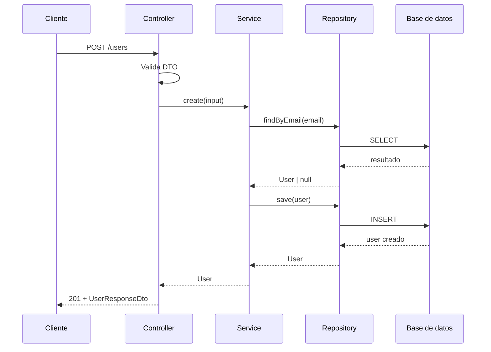

import DocsPageLayout from "/src/layouts/DocsPageLayout.astro";

<DocsPageLayout
  title="Arquitectura por Capas | MyDevNotes"
  section="Arquitectura"
  pageTitle="Arquitectura por Capas"
  pageDescription="El patrón más común en backend. Separar presentación, lógica de negocio y acceso a datos en capas bien definidas reduce el acoplamiento y hace que el código sea más fácil de mantener y testear."
  prevPage={{ href: "/arquitectura", label: "Introducción" }}
>
---
La arquitectura por capas es el estándar de facto para estructurar aplicaciones backend. Su popularidad viene de un principio simple: aislar el código en zonas con responsabilidades claras para que un cambio en la base de datos no rompa la lógica de negocio, y un cambio en el framework no afecte cómo se persisten los datos.

Ese aislamiento se traduce en bajo acoplamiento, mayor testabilidad y un sistema más predecible. Un cambio en una capa no debería obligar a tocar las demás.

### Las tres capas

El backend se divide en tres capas con fronteras claras.

**Controller (Presentación):** el punto de entrada. Su única responsabilidad es hablar HTTP: extraer datos de la request, pasarlos al servicio y serializar la respuesta.

```ts
@Post('/users')
async createUser(@Body() dto: CreateUserDto): Promise<UserResponseDto> {
  const user = await this.userService.create(dto);
  return UserResponseDto.from(user);
}
```

El controlador no decide reglas de negocio ni consulta la base de datos. Recibe, delega y responde.

**Service (Lógica de negocio):** el cerebro de la aplicación. Aplica las reglas del dominio sin saber qué es un objeto `Request` ni cómo se guarda un dato físicamente.

```ts
async create(input: CreateUserInput): Promise<User> {
  const exists = await this.userRepo.findByEmail(input.email);
  if (exists) throw new ConflictError("El email ya está registrado");

  const hashed = await hashPassword(input.password);
  return this.userRepo.save({ ...input, password: hashed });
}
```

El servicio orquesta operaciones y delega la persistencia al repositorio. No importa si por debajo hay Postgres o MongoDB.

**Repository (Acceso a datos):** abstrae la base de datos. Encapsula las consultas y mapea los resultados a entidades del dominio.

```ts
async findByEmail(email: string): Promise<User | null> {
  return this.db.users.findOne({ where: { email } });
}

async save(data: CreateUserData): Promise<User> {
  return this.db.users.create(data);
}
```

Si mañana se cambia de ORM o de base de datos, solo se toca esta capa. El servicio no se entera.

### El ciclo de vida de una request



Cada capa habla solo con la capa adyacente. El cliente nunca toca el repositorio. El servicio nunca conoce la request HTTP. Esa separación es lo que hace al sistema predecible.

### 1. Lógica de negocio en el controlador

El anti-patrón más frecuente. Controladores que validan reglas de negocio, calculan datos o toman decisiones que no les corresponden.

```ts
// Controlador haciendo demasiado
@Post('/users')
async createUser(@Body() dto: CreateUserDto) {
  const exists = await this.db.users.findOne({ where: { email: dto.email } });
  if (exists) throw new ConflictException("Email en uso");

  const age = new Date().getFullYear() - new Date(dto.birthDate).getFullYear();
  if (age < 18) throw new BadRequestException("Debe ser mayor de edad");

  const hashed = await bcrypt.hash(dto.password, 10);
  return this.db.users.create({ ...dto, password: hashed });
}
```

Este controlador sabe sobre reglas de negocio (edad mínima), accede directamente a la base de datos y hashea contraseñas. Si se necesita la misma lógica en otro endpoint o en un script interno, no hay forma de reutilizarla sin duplicar código. Y testearla exige simular un servidor HTTP completo.

```ts
// Controlador que solo habla HTTP
@Post('/users')
async createUser(@Body() dto: CreateUserDto): Promise<UserResponseDto> {
  const user = await this.userService.create(dto);
  return UserResponseDto.from(user);
}
```

Dos líneas. La lógica vive en el servicio, donde puede testearse de forma aislada y reutilizarse desde cualquier punto de entrada.

### 2. Queries y persistencia en el servicio

Cuando el servicio escribe consultas SQL directamente o depende de clases concretas del ORM, la lógica de negocio queda atada a la infraestructura.

```ts
// Servicio acoplado a Prisma
async create(input: CreateUserInput): Promise<User> {
  const exists = await this.prisma.user.findFirst({
    where: { email: input.email },
    select: { id: true },
  });
  if (exists) throw new ConflictError("Email en uso");

  return this.prisma.user.create({ data: input });
}
```

Si se migra de Prisma a TypeORM o a una llamada directa a SQL, hay que modificar el servicio aunque la regla de negocio no cambió. El cambio técnico contamina la lógica de dominio.

```ts
// Servicio que depende de una abstracción
async create(input: CreateUserInput): Promise<User> {
  const exists = await this.userRepo.findByEmail(input.email);
  if (exists) throw new ConflictError("Email en uso");

  return this.userRepo.save(input);
}
```

El servicio habla con una interfaz. La implementación concreta vive únicamente en el repositorio.

### 3. Exponer entidades de base de datos directamente

Devolver la entidad de base de datos al cliente expone la estructura interna, campos sensibles y acopla la forma de la API al modelo de persistencia.

```ts
// La entidad de BD llega al cliente tal cual
return await this.userRepo.save(user);
// respuesta: { id, email, password, createdAt, internalScore, deletedAt, ... }
```

El cliente recibe campos que nunca debería ver. Si la estructura de la tabla cambia, la API cambia también sin querer.

```ts
// Un DTO define exactamente qué sale
return UserResponseDto.from(user);
// respuesta: { id, email, name, role }
```

Un DTO (Data Transfer Object) es una clase simple cuyo único trabajo es definir la forma de los datos que entran o salen. Protege la estructura interna del dominio y hace el contrato de la API explícito y estable.

### El anti-patrón del sumidero

Ocurre cuando la mayoría de las requests atraviesan todas las capas sin que el servicio ejecute ninguna lógica real.

```ts
// El servicio es un intermediario vacío
async getUser(id: string): Promise<User> {
  return this.userRepo.findById(id);
}
```

Si el 80% de los endpoints son lecturas simples sin reglas de negocio, el servicio es puro overhead. En esos casos hay opciones más pragmáticas: el controller puede llamar directamente al repositorio para lecturas sin lógica, o se puede introducir un query service separado que no pase por el stack completo.

El sumidero no es un error absoluto, pero sí una señal de que la arquitectura por capas puede tener más costo del que el proyecto justifica.

### Cuándo es suficiente y cuándo se queda corta

Es el patrón correcto para:

* Aplicaciones mayormente CRUD.
* MVPs y proyectos en etapa temprana.
* Equipos pequeños (menos de 10 personas).
* Dominios de negocio lineales sin alta complejidad de integración.

Empieza a quedar corta cuando:

* **El dominio se vuelve complejo con muchas integraciones externas.** Si el servicio termina orquestando seis llamadas a APIs externas, eventos y bases de datos, la arquitectura hexagonal ofrece mejor aislamiento del I/O.
* **Equipos grandes trabajando en paralelo.** Cuando muchos equipos tocan las mismas capas generan conflictos. La arquitectura modular ofrece límites de propiedad más claros.
* **Las lecturas y escrituras tienen modelos muy distintos.** Si los modelos de consulta y persistencia divergen mucho, CQRS puede tener sentido.

### Cómo se conecta

* **Acoplamiento y cohesión:** cada capa tiene una responsabilidad única. Cuando la lógica de negocio sangra hacia el controlador, la cohesión baja y el acoplamiento sube exactamente como se describió en Fundamentos.
* **Testing como señal de diseño:** si testear el servicio requiere simular un servidor HTTP o una base de datos real, la separación de capas no se está respetando.
* **Diseño de APIs y Contratos:** los DTOs son la implementación práctica de un contrato bien definido entre la API y el cliente.
* **Arquitectura modular:** la siguiente parada natural cuando las capas horizontales ya no son suficientes y hace falta dividir el sistema por dominio de negocio.

### Regla práctica
Cada capa tiene una responsabilidad y habla solo con la capa adyacente. Si una capa empieza a conocer detalles de otra que no le corresponden, la separación se está rompiendo.
</DocsPageLayout>
