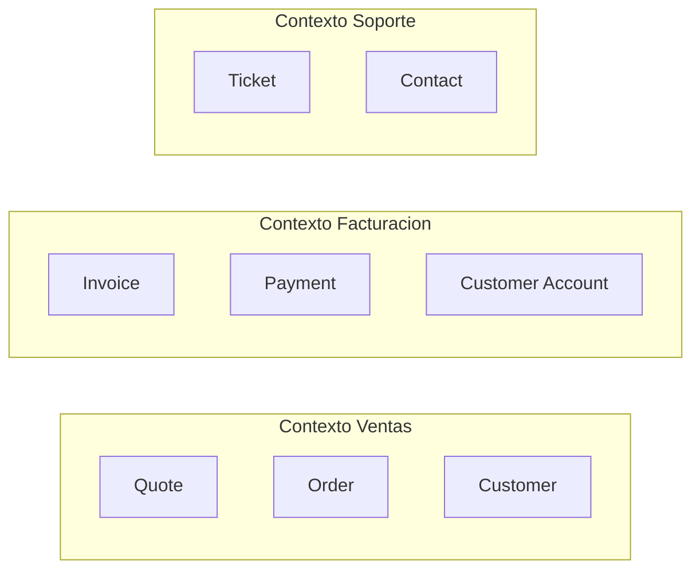

import DocsPageLayout from "/src/layouts/DocsPageLayout.astro";

<DocsPageLayout
  title="Introducción a DDD | MyDevNotes"
  section="Arquitectura"
  pageTitle="Introducción a DDD"
  pageDescription="Una entrada práctica a Domain-Driven Design para entender qué problema resuelve, cuándo aporta valor y cómo usar sus ideas básicas para que el código refleje mejor el negocio."
  prevPage={{ href: "/arquitectura/estructura-de-carpetas-y-distribucion-de-codigo", label: "Estructura de Carpetas y Distribución de Código" }}
>
---
DDD (`Domain-Driven Design`) no es un conjunto de carpetas, ni una receta de clases, ni una excusa para escribir capas ceremoniales. Es una respuesta a un problema muy específico: **cuando el software deja de representar bien cómo funciona realmente el negocio**.

Eso pasa más seguido de lo que parece. El código termina modelado alrededor de tablas, endpoints o pantallas, mientras las reglas importantes viven en la cabeza de analistas, personas de negocio o documentos dispersos. El resultado es un sistema que compila, pero que no habla el idioma del dominio que intenta resolver.

Esta página no es un curso de DDD. Es la entrada práctica: por qué existe, cuándo importa y qué conceptos básicos cambian de verdad la forma de modelar.

### El problema que resuelve

DDD aparece cuando el modelo de datos ya no alcanza para describir el sistema.

En proyectos simples, una tabla `orders` con unas cuantas columnas puede ser suficiente. Pero cuando el negocio empieza a tener reglas reales, excepciones, estados, restricciones y vocabulario propio, el modelo técnico deja de capturar lo importante.

```ts
// Modelo centrado en persistencia
type OrderRow = {
  id: string;
  status: string;
  total: number;
  customer_id: string;
  approved_by: string | null;
  approved_at: Date | null;
};
```

Esa estructura sirve para guardar datos, pero no explica nada sobre el dominio. No dice qué significa "aprobar" una orden, quién puede hacerlo, cuándo deja de ser modificable o qué reglas cambian según su estado.

```ts
type OrderStatus = "draft" | "submitted" | "approved" | "cancelled";

class Order {
  constructor(
    readonly id: string,
    private status: OrderStatus,
    private readonly total: number,
  ) {}

  approve(approverRole: "agent" | "manager"): void {
    if (this.status !== "submitted") {
      throw new Error("Solo una orden enviada puede aprobarse");
    }

    if (this.total > 5000 && approverRole !== "manager") {
      throw new Error("Las órdenes mayores a 5000 requieren un manager");
    }

    this.status = "approved";
  }
}
```

Aquí ya aparece un modelo de dominio. La diferencia no es estética: ahora las reglas importantes viven donde deberían vivir, no repartidas entre controladores, validadores y SQL.

### Lenguaje ubicuo

Una de las ideas más útiles de DDD es el **lenguaje ubicuo**: el código debería hablar el mismo idioma que usa el negocio para describir su realidad.

Si negocio habla de `cotización`, `póliza`, `renovación`, `siniestro` o `cuota vencida`, el código no debería esconder eso detrás de nombres genéricos como `data`, `process`, `item` o `handler`.

```ts
// Nombres tecnicos y vagos
async function processItem(input: InputDto): Promise<ResultDto> {
  // ...
}
```

```ts
// Nombres alineados con el dominio
async function approveQuote(input: ApproveQuoteInput): Promise<ApprovedQuote> {
  // ...
}
```

Cuando el lenguaje del código y el del negocio divergen, aparecen problemas concretos:

* reuniones donde todos usan palabras distintas para la misma cosa
* bugs porque dos áreas entienden algo distinto por `customer`, `account` o `order`
* modelos genéricos que ocultan reglas importantes

El lenguaje ubicuo no significa copiar literalmente cada palabra del negocio sin criterio. Significa que los conceptos importantes del sistema deberían tener nombres consistentes entre conversación, documentación y código.

### Bounded contexts

Otro concepto clave de DDD es que no siempre existe un único significado correcto para una palabra dentro de todo el sistema.

`Cliente` puede significar algo distinto para `Facturación`, `Soporte` y `Riesgo`. En un contexto, cliente es quien paga. En otro, es quien reporta incidentes. En otro, es una entidad evaluada por score. Intentar unificarlo todo en un modelo global suele producir un objeto inflado y ambiguo.

Los **bounded contexts** existen para evitar eso: dividen el sistema según los límites naturales del dominio.



No son módulos técnicos inventados para ordenar carpetas. Son fronteras semánticas.

La pregunta correcta no es "¿cuántos servicios hago?". La pregunta correcta es "¿dónde cambia el significado del modelo?".

### 1. Señal de bounded context mal trazado

Si una misma entidad empieza a tener campos que solo tienen sentido para áreas distintas del negocio, el contexto probablemente está mezclado.

```ts
type Customer = {
  id: string;
  billingCycle: "monthly" | "yearly";
  supportTier: "standard" | "priority";
  fraudRiskScore: number;
  invoiceAddress: string;
  lastTicketResolutionAt: Date | null;
  collectionsStatus: "healthy" | "delinquent";
};
```

Ese `Customer` parece reutilizable, pero en realidad está mezclando ventas, soporte, riesgo y cobranza. No es un modelo compartido. Es acoplamiento compartido.

### 2. Qué ganas al separar contextos

Cuando los contextos están claros:

* cada parte del sistema puede modelar sus reglas sin negociar todo con el resto
* cambia menos código por cada ajuste de negocio
* se reduce la presión por crear entidades globales artificiales
* los límites de módulos o servicios salen del dominio, no de preferencias técnicas

### Entidades y value objects

DDD también obliga a distinguir dos tipos de objetos que muchas veces se mezclan sin querer.

### Entidad

Una entidad tiene identidad propia y continuidad en el tiempo. Puede cambiar de estado sin dejar de ser la misma cosa.

```ts
class Customer {
  constructor(
    readonly id: string,
    private name: string,
  ) {}

  rename(nextName: string): void {
    this.name = nextName;
  }
}
```

Si el nombre cambia, sigue siendo el mismo `Customer`. Lo que la hace reconocible no es su contenido completo, sino su identidad.

### Value object

Un value object no se define por identidad, sino por su valor. Si dos objetos tienen el mismo valor, conceptualmente son el mismo.

```ts
class Money {
  constructor(
    readonly amount: number,
    readonly currency: "USD" | "EUR" | "CLP",
  ) {
    if (amount < 0) throw new Error("Money no puede ser negativo");
  }

  equals(other: Money): boolean {
    return this.amount === other.amount && this.currency === other.currency;
  }
}
```

No importa cuál instancia se creó primero. `Money(100, "USD")` y otro `Money(100, "USD")` representan lo mismo.

### Diferencia práctica

| Tipo | Se identifica por | Cambia en el tiempo | Ejemplos |
| --- | --- | --- | --- |
| Entidad | identidad | sí | `Customer`, `Order`, `Invoice` |
| Value object | valor | idealmente no | `Money`, `Email`, `Address`, `DateRange` |

La utilidad práctica de esta distinción es enorme:

* los value objects concentran validaciones e invariantes
* las entidades cargan las reglas que dependen de identidad y ciclo de vida
* se reducen strings y primitivos ambiguos repartidos por el sistema

```ts
// Sin value object
function registerCustomer(email: string) {
  if (!email.includes("@")) throw new Error("invalid email");
}

// Con value object
class Email {
  constructor(readonly value: string) {
    if (!value.includes("@")) throw new Error("Email inválido");
  }
}
```

El segundo caso encapsula mejor la regla y hace más explícito el modelo.

### Cuándo DDD aporta valor

DDD tiene sentido cuando:

* el negocio tiene reglas densas y lenguaje propio
* varias áreas usan conceptos similares con significados distintos
* la complejidad no está en el CRUD, sino en las decisiones del dominio
* el modelo actual ya genera fricción porque las reglas viven dispersas

Suele aportar especialmente en dominios como:

* seguros
* pagos
* logística
* salud
* marketplaces complejos
* plataformas con pricing, contratos o workflows ricos

### Cuándo es excesivo

DDD empieza a sobrar cuando:

* la aplicación es CRUD casi puro
* el lenguaje del dominio todavía cambia cada semana
* el equipo usa términos de DDD como ceremonia, no como herramienta
* se crean entidades, value objects y capas de dominio donde no hay complejidad real

Un `Todo App` con `TaskAggregateRoot`, `TaskNameValueObject` y `TaskCreatedDomainEvent` no es diseño sofisticado. Es sobreingeniería.

### Qué no cubre esta introducción

Esta página deja fuera, a propósito:

* aggregates complejos
* domain events
* CQRS
* sagas y orquestación entre contextos
* estrategias avanzadas de persistencia de dominio

No porque no importen, sino porque sin entender antes el problema de modelado, esos temas se vuelven solo vocabulario avanzado pegado encima.

### Cómo se conecta

* **Arquitectura modular:** los bounded contexts suelen ser una guía útil para decidir límites de módulos cuando el dominio ya es complejo.
* **Arquitectura limpia y hexagonal:** DDD no reemplaza estas arquitecturas. Se complementa con ellas. DDD ayuda a modelar mejor el núcleo; las arquitecturas ayudan a protegerlo de la infraestructura.
* **Monolito modular vs. microservicios:** un bounded context maduro puede ser buen candidato para extracción futura, pero contexto no significa automáticamente microservicio.
* **Estructura de carpetas:** si el modelo importa, la estructura física del código debería hacerlo visible y no esconderlo en `utils/`, `helpers/` o tablas anémicas.
* **Acoplamiento y cohesión:** DDD es, en parte, una forma de alinear alta cohesión semántica y límites de cambio reales del negocio.

### Regla práctica

Si el software habla más el idioma de la base de datos o del framework que el idioma del negocio, probablemente necesitas más pensamiento de dominio. Si el negocio todavía es simple, probablemente no necesitas DDD completo: solo necesitas modelar mejor.
</DocsPageLayout>
