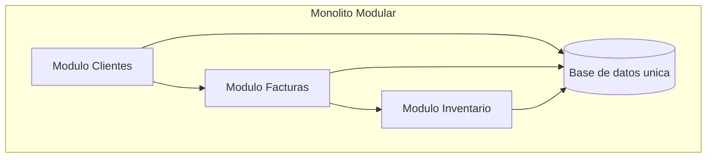
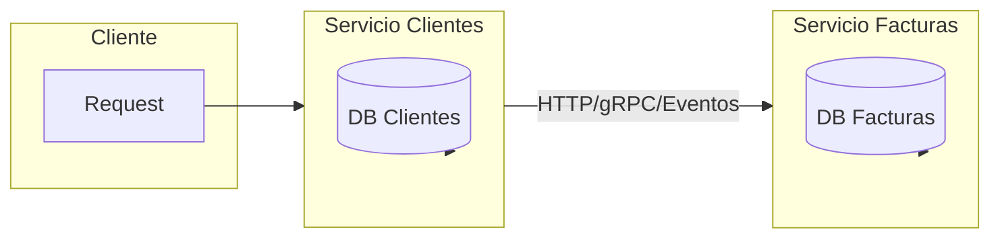
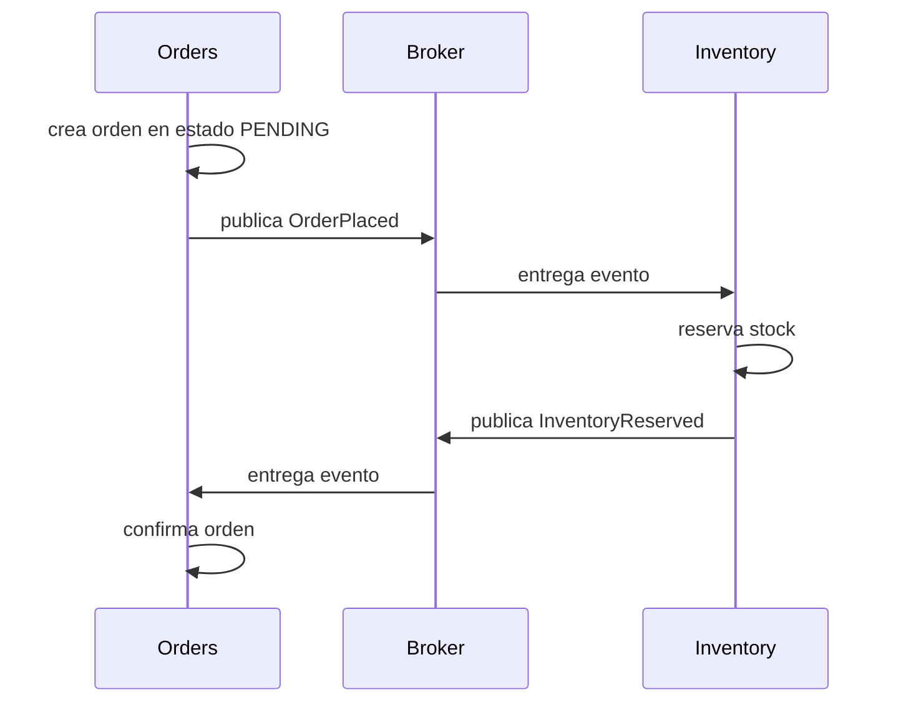
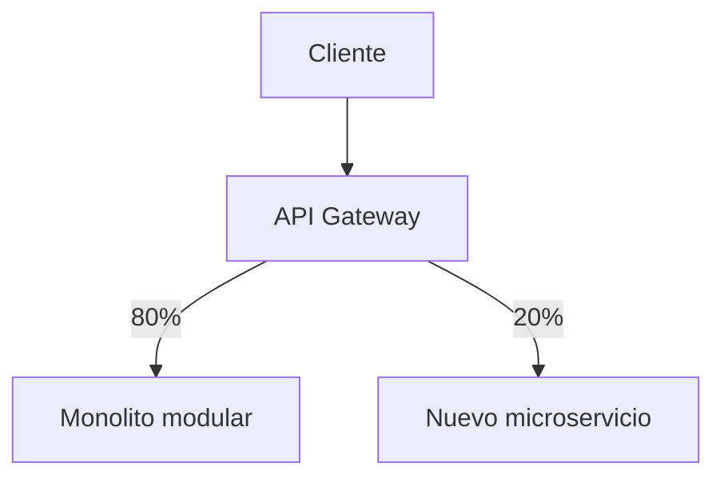

import DocsPageLayout from "/src/layouts/DocsPageLayout.astro";

<DocsPageLayout
  title="Monolito Modular vs. Microservicios | MyDevNotes"
  section="Arquitectura"
  pageTitle="Monolito Modular vs. Microservicios"
  pageDescription="La diferencia no está en si el sistema es moderno o viejo, sino en cómo se despliega y cuánto cuesta operar esa decisión. Un monolito modular bien diseñado suele ser el punto de partida correcto."
  prevPage={{ href: "/arquitectura/arquitectura-limpia", label: "Arquitectura Limpia" }}
  nextPage={{ href: "/arquitectura/estructura-de-carpetas-y-distribucion-de-codigo", label: "Estructura de Carpetas y Distribución de Código" }}
>
---
Uno de los errores más caros en arquitectura de software es mezclar dos preguntas distintas: **cómo organizo el sistema por dentro** y **cómo lo despliego por fuera**.

Un monolito y un sistema de microservicios pueden tener exactamente la misma lógica de negocio, los mismos módulos y los mismos límites conceptuales. Lo que cambia no es la calidad del diseño interno, sino la frontera operacional: un solo proceso desplegable frente a múltiples procesos distribuidos en red.

Por eso la discusión correcta no es "monolito o microservicios" como si uno fuera moderno y el otro obsoleto. La discusión correcta es: **¿en qué momento el costo operativo de distribuir el sistema se justifica por la escala técnica u organizacional que realmente tengo?**

### El error de fondo

Los microservicios no arreglan un diseño malo. Si el sistema ya está acoplado, moverlo a la red solo cambia el tipo de dolor.

Lo que antes era una llamada local desordenada se convierte en una llamada HTTP desordenada. Lo que antes era un `JOIN` indebido entre módulos se convierte en una API acoplada o en una dependencia de datos cruzada. Lo que antes era un monolito caótico pasa a ser un **monolito distribuido**: el mismo problema, pero con latencia, fallos parciales y observabilidad más difícil.

La arquitectura interna siempre se paga primero. El modelo de despliegue solo amplifica lo que ya existe.

### Qué es un monolito modular

Un monolito modular es un sistema dividido internamente en módulos con límites de negocio claros, pero que compila, arranca y se despliega como una sola unidad.



La clave no es que todo viva en el mismo repositorio o use la misma base de datos. La clave es que **sigue habiendo límites internos estrictos**, aunque el despliegue sea único.

Eso significa:

* Cada módulo tiene responsabilidad de negocio clara.
* Los módulos se comunican por interfaces públicas, no por imports arbitrarios.
* La base de datos puede ser compartida físicamente, pero no conceptualmente.
* La comunicación es en memoria, sin red, sin serialización y sin fallos distribuidos.

### Por qué no es una "Big Ball of Mud"

El problema histórico de muchos sistemas legados no era ser monolitos. Era no tener ninguna disciplina interna.

Cuando cualquier parte del código puede importar cualquier cosa, consultar cualquier tabla y meter lógica en cualquier lugar, el sistema se vuelve imposible de modificar sin miedo. Eso es una `Big Ball of Mud`.

Un monolito modular intenta exactamente lo contrario: imponer límites estrictos dentro del mismo proceso.

```ts
// Incorrecto: facturacion conoce internos de clientes
import { CustomersRepository } from "../customers/customers.repository";

export class BillingService {
  constructor(private readonly customersRepo: CustomersRepository) {}

  async issueInvoice(customerId: string) {
    const customer = await this.customersRepo.findById(customerId);
    // facturacion depende de detalles internos de customers
  }
}
```

```ts
// Correcto: facturacion depende de la API publica del modulo customers
import { CustomersService } from "../customers";

export class BillingService {
  constructor(private readonly customersService: CustomersService) {}

  async issueInvoice(customerId: string) {
    const customer = await this.customersService.findBillingProfile(customerId);
    // facturacion consume un contrato explicito
  }
}
```

La diferencia es importante: el problema no es que ambos módulos vivan en el mismo proceso. El problema sería que no hubiera frontera entre ellos.

### El costo real de los microservicios

Un microservicio no es "un módulo más pequeño". Es un proceso independiente que se comunica por red, se despliega por separado y opera con autonomía parcial o total.



Eso trae ventajas reales, pero también un impuesto inmediato.

| Tema | Monolito Modular | Microservicios |
| --- | --- | --- |
| Llamadas internas | En memoria, rápidas y estables. | Por red, con latencia y posibilidad de fallo. |
| Consistencia | Transacciones locales sencillas. | Consistencia eventual o coordinación distribuida. |
| Observabilidad | Más simple. Un proceso, menos saltos. | Requiere tracing, logs centralizados y correlación. |
| Despliegue | Una sola unidad. | Múltiples pipelines, versiones y contratos. |
| Carga cognitiva | Menor. | Mucho mayor. |
| Escalado | Todo junto, salvo optimizaciones internas. | Escalado independiente por servicio. |

La parte más ignorada suele ser esta: al pasar a microservicios aceptas voluntariamente las falacias de la computación distribuida.

### 1. Fallos parciales

En un monolito, una llamada entre módulos es una llamada normal del lenguaje. En microservicios, esa llamada puede:

* tardar demasiado
* devolver timeout
* caer por red
* responder con una versión incompatible
* fallar solo para un porcentaje del tráfico

Eso obliga a introducir mecanismos que antes no existían: timeouts, reintentos, `circuit breakers`, backoff exponencial, idempotencia y manejo explícito de degradación.

### 2. Consistencia eventual

En un monolito modular, crear una orden y descontar inventario puede ser una transacción local.

```ts
await db.transaction(async () => {
  await ordersRepo.create(order);
  await inventoryRepo.reserve(items);
});
```

En microservicios, esas dos operaciones viven en procesos distintos y probablemente en bases de datos distintas. Ya no hay un `COMMIT` único. Aparece la necesidad de coordinar estados intermedios, compensaciones y eventos.



Esto no es malo por definición. Pero sí es más complejo. Si el negocio no necesita ese costo, pagar ese costo es mala ingeniería.

### 3. Sobrecarga operativa

Microservicios no es solo diseño. Es operación.

Para correrlos de forma seria necesitas al menos:

* observabilidad distribuida
* estrategia de versionado de contratos
* despliegues independientes
* manejo de secretos y configuración por servicio
* debugging de entornos locales más complejo
* monitoreo por dependencia y por hop de red

Si la organización no tiene madurez operativa para esto, los microservicios empiezan a frenar al equipo en lugar de liberarlo.

### Cuándo no conviene dar el salto

No conviene cuando:

* El equipo sigue siendo pequeño y se coordina bien en un mismo repositorio.
* El dominio cambia rápido y los límites aún no están estabilizados.
* La mayor parte del sistema es CRUD con reglas simples.
* No existen necesidades de escalado radicalmente distintas entre módulos.
* El costo de CI/CD, observabilidad y operación distribuida sería mayor que el beneficio.

En esas condiciones, un monolito modular bien diseñado suele ser la mejor opción. Da límites claros, mantiene el costo bajo y deja abierta una evolución futura.

### Cuándo sí se justifican

Tiene sentido evaluar microservicios cuando:

* Hay varios equipos que ya chocan constantemente en despliegues, ownership y tiempos de integración.
* Un módulo necesita escalar de forma muy distinta al resto.
* Algunos componentes requieren tecnologías incompatibles dentro del mismo proceso.
* La independencia de despliegue tiene valor real y frecuente, no solo potencial.

El punto importante es este: **los microservicios se justifican por restricciones concretas, no por aspiración estética**.

### La ruta pragmática: empezar modular, extraer después

La estrategia más sensata rara vez es comenzar distribuido desde el día uno. Lo normal es empezar con un monolito modular y extraer solo cuando el sistema lo pida de verdad.


El camino típico se ve así:

1. Diseñar módulos internos con fronteras claras.
2. Asegurar que cada módulo acceda solo a sus propios datos.
3. Evitar imports y consultas cruzadas entre módulos.
4. Detectar qué módulo sufre presión real de escalado u organización.
5. Extraer primero un módulo maduro y relativamente estable.

Ese enfoque reduce riesgo porque la separación ocurre sobre un límite ya probado en producción.

### Qué significa "separación de datos primero"

Antes de extraer código a un microservicio, hay que romper el acoplamiento por datos.

Si `billing` necesita leer cinco tablas internas de `orders`, ese límite todavía no existe. Extraer el módulo en ese estado solo convierte una dependencia implícita en una dependencia remota frágil.

La señal de que el módulo está listo es esta: el resto del sistema ya puede hablar con él mediante un contrato claro, sin tocar sus tablas internas ni sus clases privadas.

### El patrón del estrangulador

Cuando llega el momento de extraer, no hace falta reescribir todo de golpe. La estrategia sana es mover tráfico gradualmente.



El gateway o proxy puede dirigir parte del tráfico al servicio nuevo mientras el resto sigue resolviéndose en el monolito. Cuando el comportamiento está validado, el código viejo se elimina.

Esto reduce riesgo operativo y evita el clásico error de intentar una gran migración que queda a medio camino.

### Cómo se conecta

* **Arquitectura modular:** el monolito modular es, en esencia, arquitectura modular aplicada dentro de una sola unidad de despliegue.
* **Arquitectura hexagonal y limpia:** cada módulo interno puede organizarse con hexagonal o limpia si su complejidad lo justifica. El modelo de despliegue no reemplaza el diseño interno.
* **Acoplamiento y cohesión:** extraer un microservicio no arregla bajo acoplamiento. Si el límite está mal dentro del monolito, también estará mal fuera.
* **DDD:** los bounded contexts maduros suelen ser buenos candidatos de extracción, pero no todo bounded context debe convertirse en microservicio.
* **Testing como señal de diseño:** si no puedes testear un módulo del monolito sin instanciar medio sistema, todavía no está listo para separarse.

### Regla práctica

Empieza con un monolito modular y paga el costo de microservicios solo cuando un límite ya probado necesite independencia real de despliegue, escalado u ownership. Distribuir antes de entender el dominio casi siempre convierte complejidad evitable en complejidad permanente.
</DocsPageLayout>
